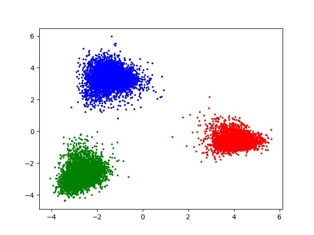
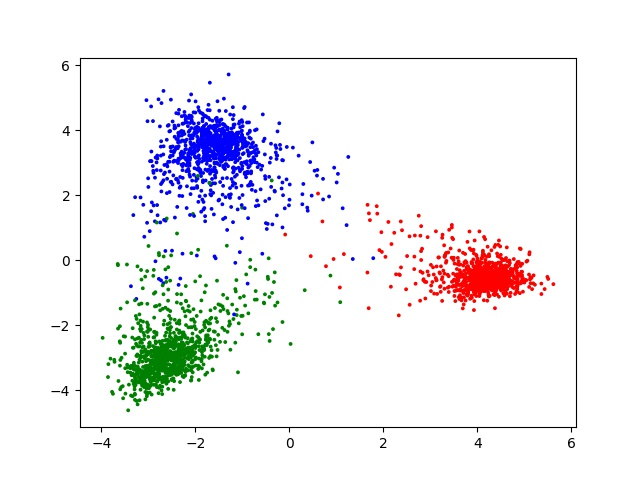
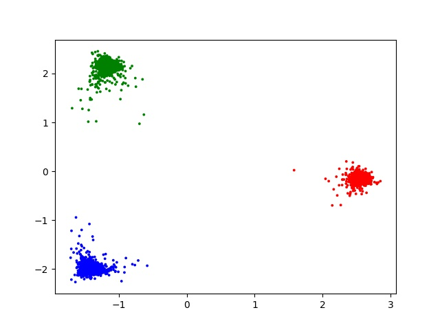
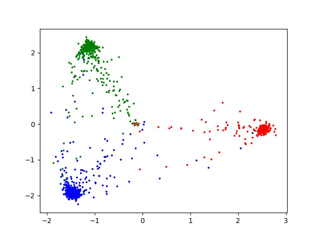

# When Does Label Smoothing Help? - Visualization

Unofficial PyTorch implementation of penultimate layer visualization in the paper [*When Does Label Smoothing Help?*](https://arxiv.org/pdf/1906.02629.pdf)

## Requirements

```
pytorch
scikit-learn
matplotlib
tensorboardX
```

## Result

I trained ResNet-18 on CIFAR-10 dataset, with and without label smoothing. All train set is used for training, and test set is used for validation. The trained models achieved 94.9% (without label smoothing) and 95.1% (with label smoothing) on test set.

Below is visualizations of penultimate layer of each models. (Note: this implementation of visualization may be incorrect.)

When label smoothing is applied, you can see that *"the clusters are much tighter, because label smoothing encourages that each example in training set to be equidistant from all the other class's templates."*

### CIFAR-10 / ResNet-18 Without Label Smoothing



without label smoothing - train



without label smoothing - test

### CIFAR-10 / ResNet-18 With Label Smoothing (alpha=0.1)



with label smoothing - train



with label smoothing - test
